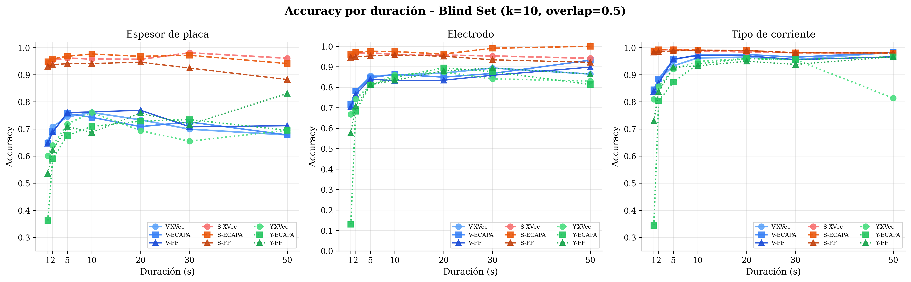
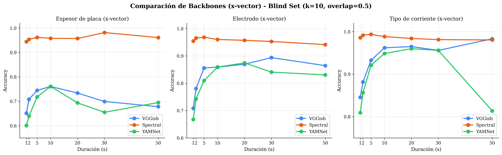
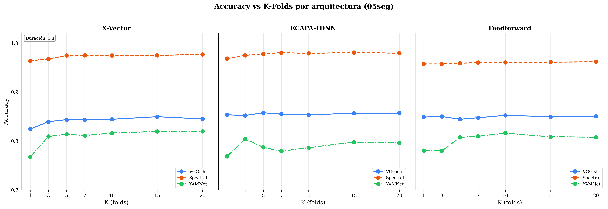
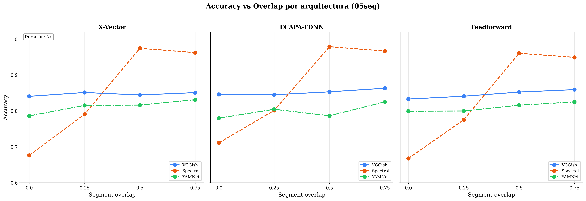

# Spectral Analysis — Resultados (Blind Set)

**Backbone:** MFCC (características espectrales)  
**Configuración:** k-fold = 10, overlap = 0.5  
**Datos:** `inferencia.json` (conjunto ciego)

---

## Mejor Modelo (5 s): ECAPA-TDNN

| Métrica            |    Valor    |
| ------------------ | :---------: |
| Exact Match        | **94.51 %** |
| Hamming Accuracy   | **97.88 %** |
| Plate Accuracy     |   96.82 %   |
| Electrode Accuracy |   97.59 %   |
| Current Accuracy   |   99.23 %   |

---

## Comparación de Arquitecturas (5 s)

| Modelo         | Plate Acc | Electrode Acc | Current Acc | Exact Match | Hamming Acc |
| -------------- | :-------: | :-----------: | :---------: | :---------: | :---------: |
| X-Vector       |  96.16 %  |    96.82 %    |   99.34 %   |   93.74 %   |   97.44 %   |
| **ECAPA-TDNN** |  96.82 %  |    97.59 %    |   99.23 %   | **94.51 %** | **97.88 %** |
| Feedforward    |  94.07 %  |    95.28 %    |   98.79 %   |   90.89 %   |   96.05 %   |

---

## Resultados por Duración

### X-Vector

| Duración | Plate Acc | Electrode Acc | Current Acc | Exact Match | Hamming Acc |
| :------: | :-------: | :-----------: | :---------: | :---------: | :---------: |
|   1 s    |  94.40 %  |    95.43 %    |   98.56 %   |   91.50 %   |   96.13 %   |
|   2 s    |  95.35 %  |    96.53 %    |   99.15 %   |   92.81 %   |   97.01 %   |
|   5 s    |  96.16 %  |    96.82 %    |   99.34 %   |   93.74 %   |   97.44 %   |
|   10 s   |  95.77 %  |    96.01 %    |   98.83 %   |   92.49 %   |   96.87 %   |
|   20 s   |  95.70 %  |    95.70 %    |   98.39 %   |   91.94 %   |   96.59 %   |
|   30 s   |  98.11 %  |    95.28 %    |   98.11 %   |   93.40 %   |   97.17 %   |
|   50 s   |  96.08 %  |    94.12 %    |   98.04 %   |   90.20 %   |   96.08 %   |

### ECAPA-TDNN

| Duración | Plate Acc | Electrode Acc | Current Acc | Exact Match | Hamming Acc |
| :------: | :-------: | :-----------: | :---------: | :---------: | :---------: |
|   1 s    |  94.82 %  |    95.97 %    |   98.68 %   |   92.31 %   |   96.49 %   |
|   2 s    |  95.81 %  |    97.08 %    |   99.24 %   |   93.62 %   |   97.38 %   |
|   5 s    |  96.82 %  |    97.59 %    |   99.23 %   |   94.51 %   |   97.88 %   |
|   10 s   |  97.65 %  |    97.42 %    |   99.06 %   |   94.84 %   |   98.04 %   |
|   20 s   |  96.77 %  |    96.24 %    |   98.92 %   |   94.62 %   |   97.31 %   |
|   30 s   |  97.17 %  |    99.06 %    |   98.11 %   |   94.34 %   |   98.11 %   |
|   50 s   |  94.12 %  |   100.00 %    |   98.04 %   |   92.16 %   |   97.39 %   |

### Feedforward

| Duración | Plate Acc | Electrode Acc | Current Acc | Exact Match | Hamming Acc |
| :------: | :-------: | :-----------: | :---------: | :---------: | :---------: |
|   1 s    |  93.04 %  |    94.61 %    |   98.33 %   |   89.78 %   |   95.33 %   |
|   2 s    |  93.74 %  |    94.80 %    |   98.44 %   |   90.19 %   |   95.66 %   |
|   5 s    |  94.07 %  |    95.28 %    |   98.79 %   |   90.89 %   |   96.05 %   |
|   10 s   |  94.13 %  |    95.77 %    |   99.06 %   |   91.08 %   |   96.32 %   |
|   20 s   |  94.62 %  |    95.16 %    |   98.92 %   |   91.94 %   |   96.24 %   |
|   30 s   |  92.45 %  |    93.40 %    |   98.11 %   |   87.74 %   |   94.65 %   |
|   50 s   |  88.24 %  |    92.16 %    |   98.04 %   |   84.31 %   |   92.81 %   |

---

## Tiempos de Extracción de Características

| Duración | Tiempo (s) | Segmentos |
| :------: | :--------: | :-------: |
|   1 s    |   337.14   |  43 170   |
|   2 s    |   221.22   |  21 313   |
|   5 s    |   95.20    |   8 185   |
|   10 s   |   59.74    |   3 819   |
|   20 s   |   29.38    |   1 640   |
|   30 s   |   19.77    |    918    |
|   50 s   |   15.73    |    448    |

---

## Matrices de Confusión — ECAPA-TDNN (5 s)

### Plate (Espesor de placa)

### Electrode (Tipo de electrodo)

### Current (Tipo de corriente)

---

## Gráficas

### Accuracy por duración

### F1-score por duración

### Métricas globales (Exact Match y Hamming)

### Comparación por backbone

### Comparación por k-folds

### Comparación por overlap

### Tiempos de extracción

### Tiempos de entrenamiento

### Tiempos de inferencia

