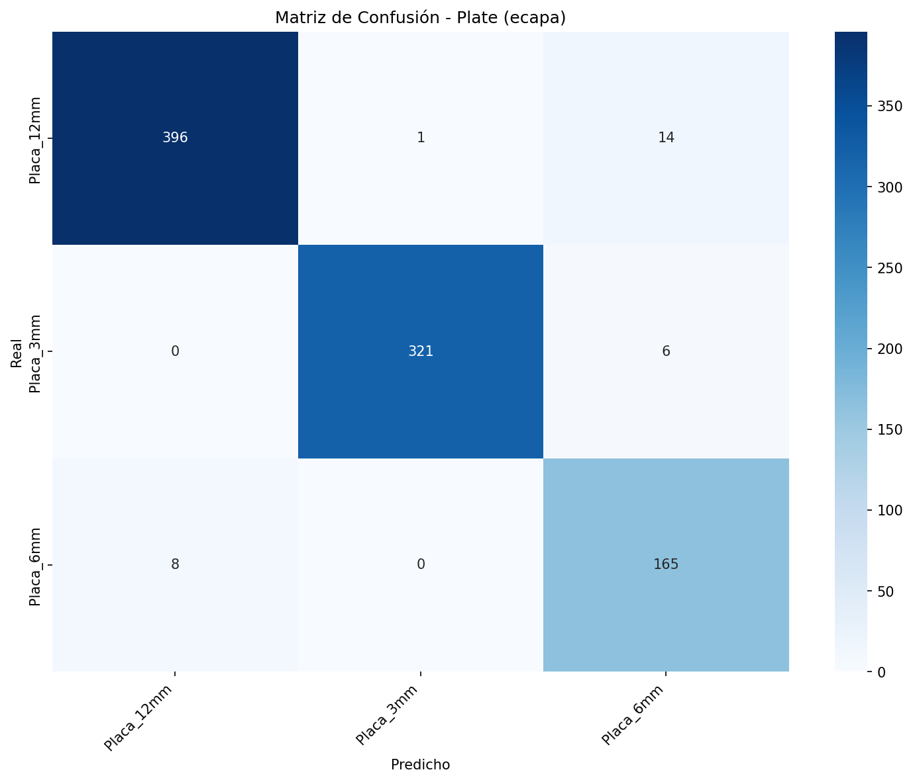
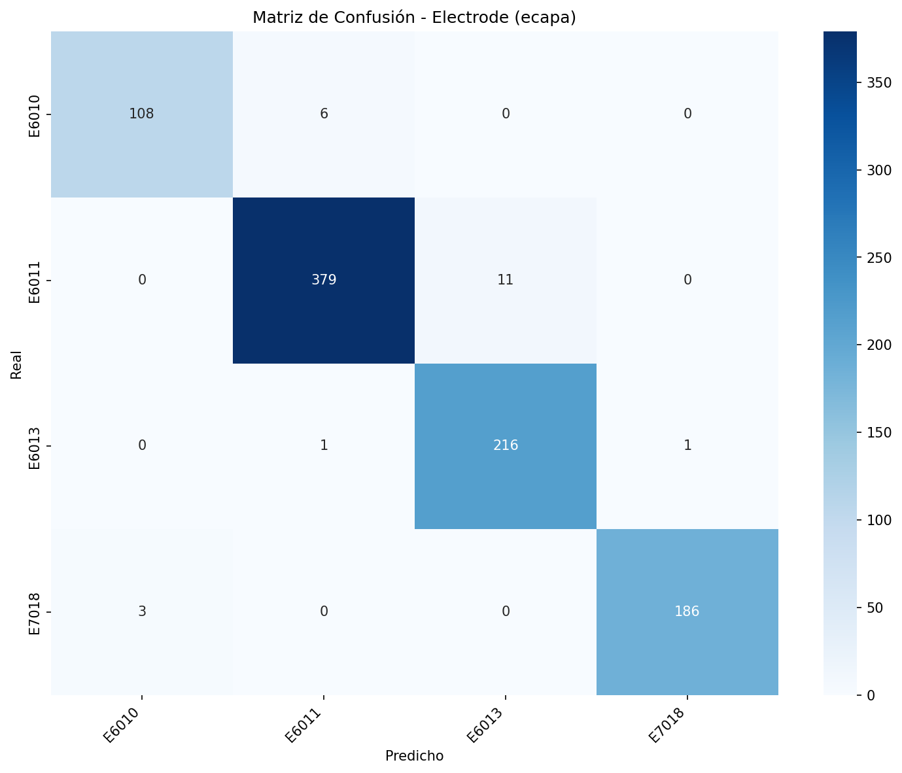
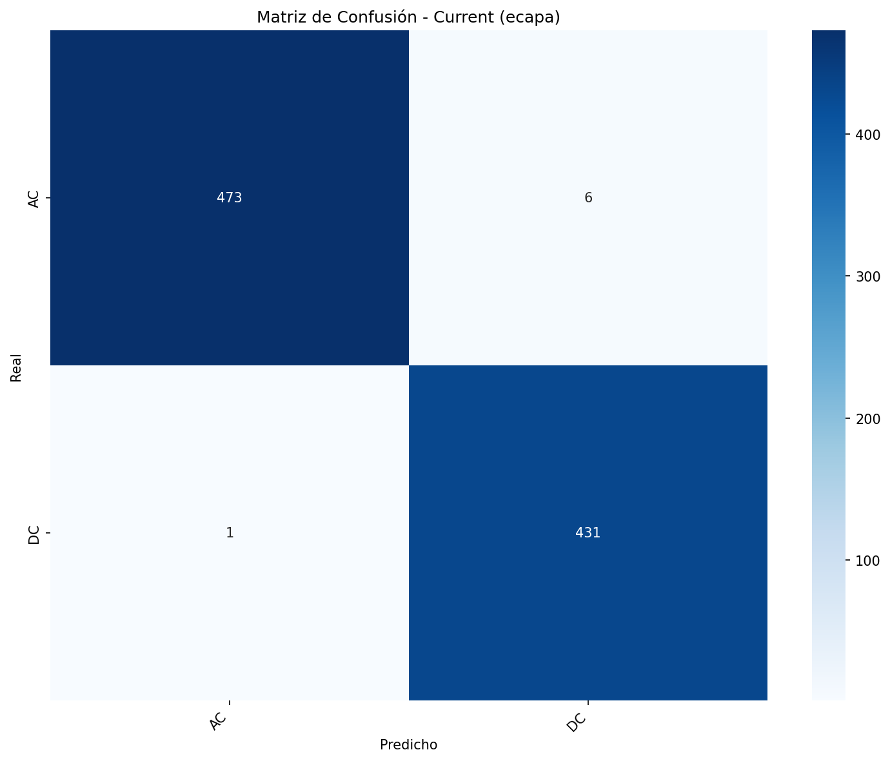
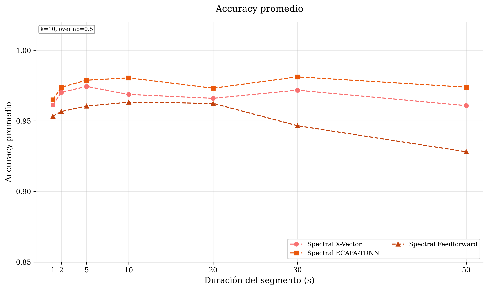
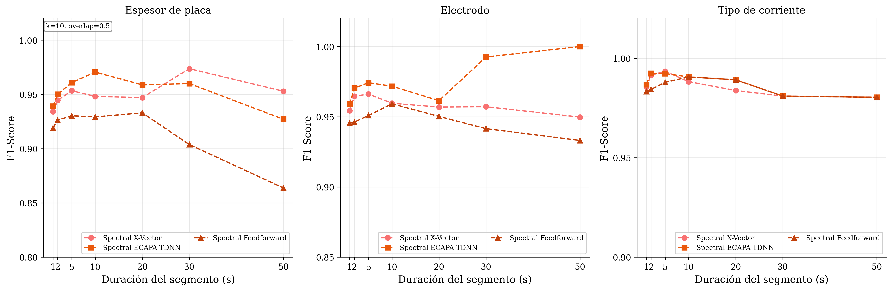
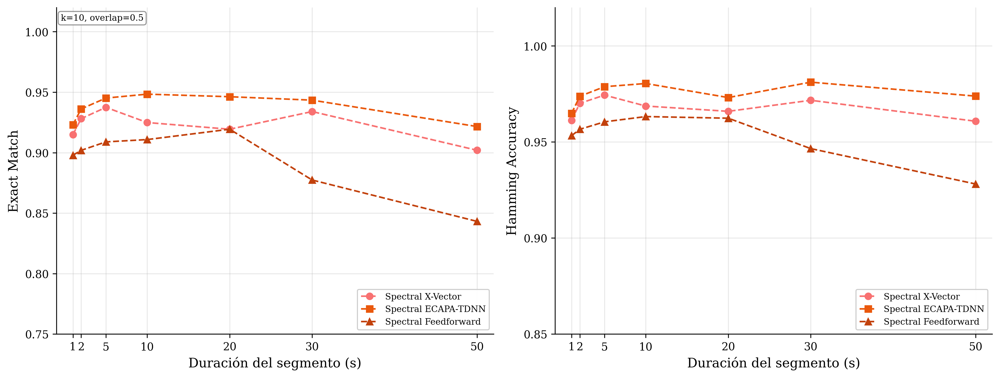
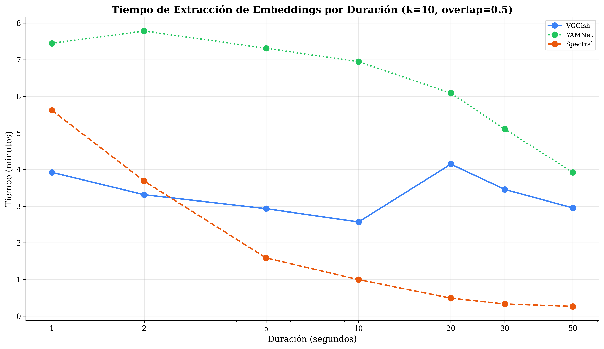
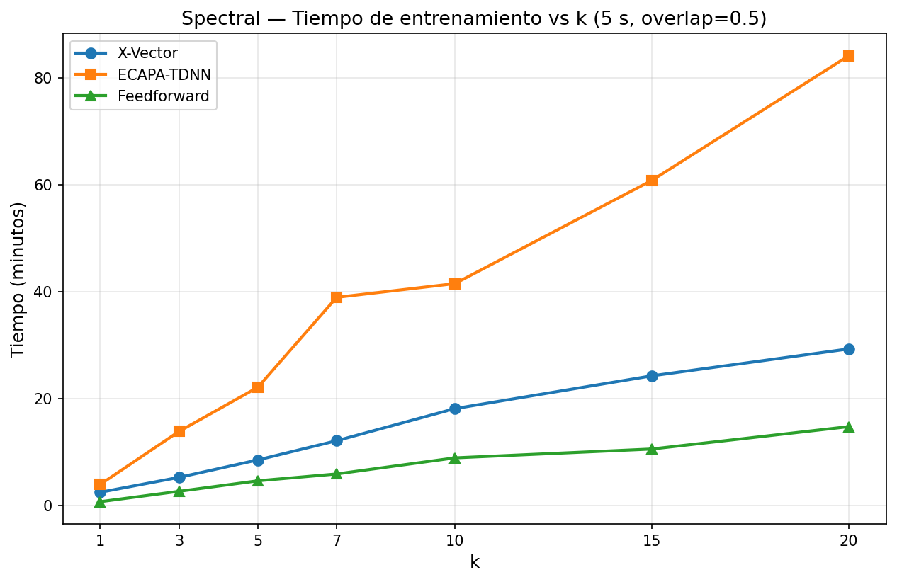
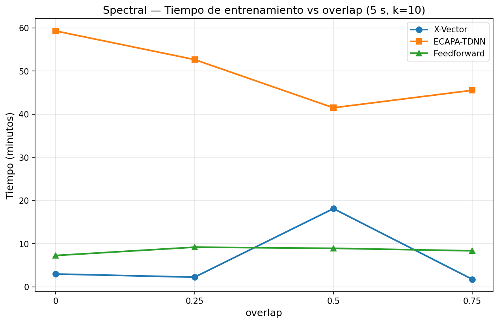

# Spectral Analysis — Resultados (Blind Set)

**Enfoque:** MFCC (características espectrales)  
**Configuración:** k-fold = 10, overlap = 0.5  
**Datos:** `inferencia.json` (conjunto ciego)

---

## Mejor Modelo (5 s): ECAPA-TDNN

| Métrica            |    Valor    |
| ------------------ | :---------: |
| Exact Match        | **94.51 %** |
| Hamming Accuracy   | **97.88 %** |
| Plate Accuracy     |   96.82 %   |
| Electrode Accuracy |   97.59 %   |
| Current Accuracy   |   99.23 %   |

---

## Comparación de Arquitecturas (5 s)

| Modelo         | Plate Acc | Electrode Acc | Current Acc | Exact Match | Hamming Acc |
| -------------- | :-------: | :-----------: | :---------: | :---------: | :---------: |
| X-Vector       |  96.16 %  |    96.82 %    |   99.34 %   |   93.74 %   |   97.44 %   |
| **ECAPA-TDNN** |  96.82 %  |    97.59 %    |   99.23 %   | **94.51 %** | **97.88 %** |
| Feedforward    |  94.07 %  |    95.28 %    |   98.79 %   |   90.89 %   |   96.05 %   |

---

## Resultados por Duración

### X-Vector

| Duración | Plate Acc | Electrode Acc | Current Acc | Exact Match | Hamming Acc |
| :------: | :-------: | :-----------: | :---------: | :---------: | :---------: |
|   1 s    |  94.40 %  |    95.43 %    |   98.56 %   |   91.50 %   |   96.13 %   |
|   2 s    |  95.35 %  |    96.53 %    |   99.15 %   |   92.81 %   |   97.01 %   |
|   5 s    |  96.16 %  |    96.82 %    |   99.34 %   |   93.74 %   |   97.44 %   |
|   10 s   |  95.77 %  |    96.01 %    |   98.83 %   |   92.49 %   |   96.87 %   |
|   20 s   |  95.70 %  |    95.70 %    |   98.39 %   |   91.94 %   |   96.59 %   |
|   30 s   |  98.11 %  |    95.28 %    |   98.11 %   |   93.40 %   |   97.17 %   |
|   50 s   |  96.08 %  |    94.12 %    |   98.04 %   |   90.20 %   |   96.08 %   |

### ECAPA-TDNN

| Duración | Plate Acc | Electrode Acc | Current Acc | Exact Match | Hamming Acc |
| :------: | :-------: | :-----------: | :---------: | :---------: | :---------: |
|   1 s    |  94.82 %  |    95.97 %    |   98.68 %   |   92.31 %   |   96.49 %   |
|   2 s    |  95.81 %  |    97.08 %    |   99.24 %   |   93.62 %   |   97.38 %   |
|   5 s    |  96.82 %  |    97.59 %    |   99.23 %   |   94.51 %   |   97.88 %   |
|   10 s   |  97.65 %  |    97.42 %    |   99.06 %   |   94.84 %   |   98.04 %   |
|   20 s   |  96.77 %  |    96.24 %    |   98.92 %   |   94.62 %   |   97.31 %   |
|   30 s   |  97.17 %  |    99.06 %    |   98.11 %   |   94.34 %   |   98.11 %   |
|   50 s   |  94.12 %  |   100.00 %    |   98.04 %   |   92.16 %   |   97.39 %   |

### Feedforward

| Duración | Plate Acc | Electrode Acc | Current Acc | Exact Match | Hamming Acc |
| :------: | :-------: | :-----------: | :---------: | :---------: | :---------: |
|   1 s    |  93.04 %  |    94.61 %    |   98.33 %   |   89.78 %   |   95.33 %   |
|   2 s    |  93.74 %  |    94.80 %    |   98.44 %   |   90.19 %   |   95.66 %   |
|   5 s    |  94.07 %  |    95.28 %    |   98.79 %   |   90.89 %   |   96.05 %   |
|   10 s   |  94.13 %  |    95.77 %    |   99.06 %   |   91.08 %   |   96.32 %   |
|   20 s   |  94.62 %  |    95.16 %    |   98.92 %   |   91.94 %   |   96.24 %   |
|   30 s   |  92.45 %  |    93.40 %    |   98.11 %   |   87.74 %   |   94.65 %   |
|   50 s   |  88.24 %  |    92.16 %    |   98.04 %   |   84.31 %   |   92.81 %   |

---

## Tiempos de Extracción de Características

| Duración | Tiempo (s) | Segmentos |
| :------: | :--------: | :-------: |
|   1 s    |   337.14   |  43 170   |
|   2 s    |   221.22   |  21 313   |
|   5 s    |   95.20    |   8 185   |
|   10 s   |   59.74    |   3 819   |
|   20 s   |   29.38    |   1 640   |
|   30 s   |   19.77    |    918    |
|   50 s   |   15.73    |    448    |

---

## Matrices de Confusión — ECAPA-TDNN (5 s)

### Plate (Espesor de placa)

### Electrode (Tipo de electrodo)

### Current (Tipo de corriente)

---

## Gráficas

Las siguientes gráficas muestran el rendimiento de evaluación sobre el conjunto ciego usando métricas globales y por tarea según la duración del segmento de audio. El modelo evaluado pertenece únicamente a la arquitectura probada.

### Accuracy por duración

### F1-score por duración

### Métricas globales (Exact Match y Hamming Accuracy)

---

### Tiempos de extracción de características por duración

Tiempo de extracción total y por archivo según duración del segmento:

| Duración | Tiempo total (s) | Segmentos | ms/archivo |
| :------: | :--------------: | :-------: | :--------: |
|   1 s    |      337.14      |  43 170   |    7.81    |
|   2 s    |      221.22      |  21 313   |   10.38    |
|   5 s    |      95.20       |   8 185   |   11.63    |
|   10 s   |      59.74       |   3 819   |   15.64    |
|   20 s   |      29.38       |   1 640   |   17.91    |
|   30 s   |      19.77       |    918    |   21.54    |
|   50 s   |      15.73       |    448    |   35.11    |

### Tiempos de entrenamiento por duración

Tiempo de entrenamiento (k=10, overlap=0.5) por arquitectura según duración del segmento:

| Duración | X-Vector (s) | ECAPA-TDNN (s) | Feedforward (s) | X-Vector (min) | ECAPA-TDNN (min) | Feedforward (min) |
| :------: | :----------: | :------------: | :-------------: | :------------: | :--------------: | :---------------: |
|   1 s    |    404.0     |     2465.8     |      151.3      |      6.73      |      41.10       |       2.52        |
|   2 s    |    238.8     |     402.7      |      85.0       |      3.98      |       6.71       |       1.42        |
|   5 s    |    454.7     |     368.3      |      534.5      |      7.58      |       6.14       |       8.91        |
|   10 s   |    269.7     |     310.5      |      40.8       |      4.50      |       5.18       |       0.68        |
|   20 s   |    108.0     |     127.0      |      263.5      |      1.80      |       2.12       |       4.39        |
|   30 s   |     59.4     |      67.5      |      60.0       |      0.99      |       1.13       |       1.00        |
|   50 s   |     53.4     |      54.5      |      48.7       |      0.89      |       0.91       |       0.81        |

### Tiempos de entrenamiento vs k (5 s, overlap=0.5)

Tiempo de entrenamiento por arquitectura para Study 2 (duración fija 5 s), usando datos de `resultados.json`.

|  k  | X-Vector (s) | ECAPA-TDNN (s) | Feedforward (s) | X-Vector (min) | ECAPA-TDNN (min) | Feedforward (min) |
| :-: | :----------: | :------------: | :-------------: | :------------: | :--------------: | :---------------: |
|  1  |    149.07    |     236.71     |      43.25      |      2.48      |       3.95       |       0.72        |
|  3  |    316.14    |     831.28     |     159.64      |      5.27      |      13.85       |       2.66        |
|  5  |    511.96    |    1326.60     |     277.55      |      8.53      |      22.11       |       4.63        |
|  7  |    727.19    |    2335.74     |     354.51      |     12.12      |      38.93       |       5.91        |
| 10  |   1087.29    |    2489.81     |     535.21      |     18.12      |      41.50       |       8.92        |
| 15  |   1455.47    |    3648.21     |     634.33      |     24.26      |      60.80       |       10.57       |
| 20  |   1757.73    |    5047.27     |     885.41      |     29.30      |      84.12       |       14.76       |

### Tiempos de entrenamiento vs overlap (5 s, k=10)

Tiempo de entrenamiento por arquitectura para Study 3 (duracion fija 5 s, k=10), usando datos de `resultados.json`.

| Overlap | X-Vector (s) | ECAPA-TDNN (s) | Feedforward (s) | X-Vector (min) | ECAPA-TDNN (min) | Feedforward (min) |
| :-----: | :----------: | :------------: | :-------------: | :------------: | :--------------: | :---------------: |
|    0    |    178.13    |    3557.94     |     435.60      |      2.97      |      59.30       |       7.26        |
|  0.25   |    134.30    |    3160.32     |     551.16      |      2.24      |      52.67       |       9.19        |
|   0.5   |   1087.29    |    2489.81     |     535.21      |     18.12      |      41.50       |       8.92        |
|  0.75   |    104.54    |    2733.12     |     500.67      |      1.74      |      45.55       |       8.34        |

### Tiempos de inferencia por archivo (5 s, k=10, overlap=0.5)

Tiempo de inferencia sobre el conjunto ciego en segmentos de 5 s:

| Arquitectura | Tiempo total (s) | s/archivo | ms/archivo |
| ------------ | :--------------: | :-------: | :--------: |
| X-Vector     |      22.91       |   0.025   |   25.15    |
| ECAPA-TDNN   |      97.03       |   0.107   |   106.50   |
| Feedforward  |       9.79       |   0.011   |   10.74    |

